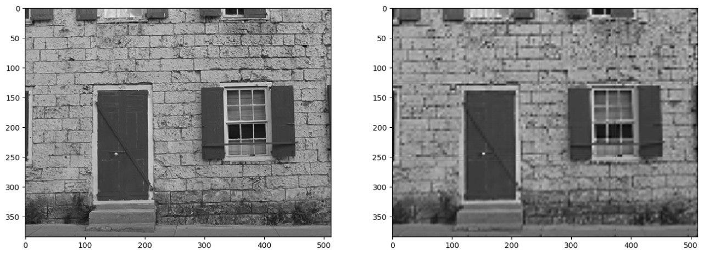
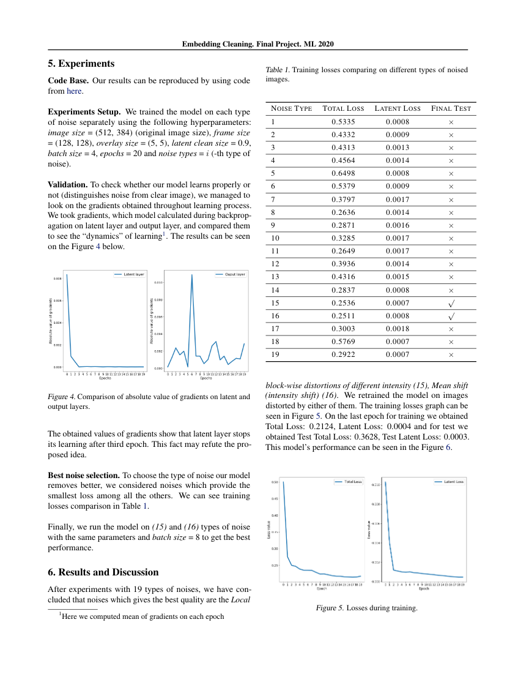
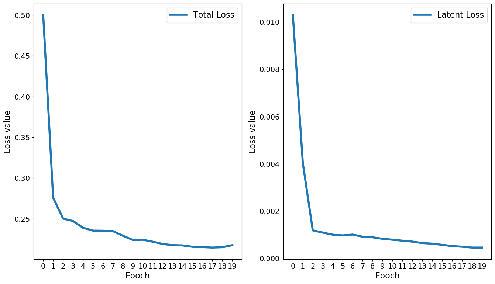
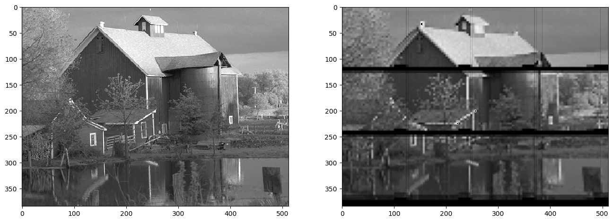

# Noiseless
Project for denoising images

## Installation

In order to install all dependencies properly, please use `virtualenv` python package.
It can be done by command:

```
sudo pip3 install virtualenv
```

Once `virtualenv` is installed, please create virtual environment near by utilizing command:

```
python3 -m venv noiseless_env
```
Then activate it by command:

```
source noiseless_env/bin/activate
```
Once environment was activated, one could install all the dependencies utilizing command:

```
pip install -r PATH_TO_CLONED_REPOSITORY/requirements.txt
```

Where `PATH_TO_CLONED_REPOSITORY` is the path to current cloned repository.

## Dataset decription

For the purposes of current project [TAMPERE IMAGE DATABASE 2008]( http://www.ponomarenko.info/tid2008.htm ) was chosen. It has 25 reference images (clean) and 1700 corrupted images (each reference image is corrupted with 17 types of noise, each noise has 4 levels of strength).

### How to download dataset

In order to obtain the dataset, one can use this [link to download it (550 mb)](http://www.ponomarenko.info/tid/tid2008.rar).

This archive should be unpacked. It has the following structure:

```
├───distorted_images
├───metrics_values
├───mos.txt
├───mos_std.txt
├───mos_with_names.txt
├───papers
├───readme
└───reference_images
```
But we are interested in two folders: 
```
reference_images

distorted_images
```

### How to add our custom noise (optional)

To expand the set of distorted images you can apply our custom gaussian noise or random erasing noise. For this purpose we have `gaussian_noise_overlay.py` and `erasing_noise_overlay.py`  in the folder `scripts`.

Example of usage:

```
python gaussian_noise_overlay.py --path_to_clean_images=<str> --path_to_corrupted_images=<str> [--noise_type=<int>]
```

```
python erasing_noise_overlay.py --path_to_clean_images=<str> --path_to_corrupted_images=<str> [--noise_type=<int>]
```

Here `path_to_clean_images` flag should point to absolute path to `reference_images` folder,

`path_to_corrupted_images` flag should point to absolute path to `distorted_images` folder.

If you will use all 17 noise types, please specify `noise_type` as 18 and 19, respectively. If you will use `n` noise types, please specify `noise_type` as `n+1` and `n+2`, respectively.

### How to create folders structure necessary for training our model

To train a model we need to have the following data structure:

```
data
│   ├───clean
│   ├───noised_{i}
│   └───only_noise_{i}
```

```data/```

- ```clean/``` - folder with reference images
- ```noised_{i}/``` -  folder with noised images, where "i" is the type of noise (1 to 19 in case you use 17 noises from the initial dataset and 2 our custom noises)
- ```only_noise_{i}/``` - folder with difference of noised images and reference images, where "i" has the same meaning as above

Such structure can be generated via our script ```data_splitting.py```  in the folder ```./scripts/```. 
**Folder `data` should be in the repository folder**.

Example usage:

```
python data_splitting.py --path_to_corrupted=<str> --path_to_reference=<str> 
--path_for_processed=<str> [--num_noises=<int> --noise_level=<int>]
```


Here, as before, `path_to_reference` flag should point to absolute path to `reference_images` folder,

`path_to_corrupted` flag should point to absolute path to `distorted_images` folder.

## Model

### Autoencoder mode

If you want to test architecture and learn model like classical autoencoder, you may use notebook 
`TestAutoencoderStructure.ipynb`, which is inside `Notebook` folder.


### How to train model

In order to train model you should run `train_test.py` script.

To get full description of flags one can use the command:

```
python train_test.py -h
```

The example of usage:

```
python ./train_test.py --train=True --noise_types="1, 2" --image_size="512, 384" --frame_size="64, 64" --overlay_size="5, 5" --latent_clean_size=0.9 --batch_size=4 --epochs=20 --test=True
```

## Results

### Pure Autoencoder

First of all, we trained our model like usual autoencoder. The result of its performance is shown on the picture below.



### Latent space learning

Then we trained Autoencoder with additional loss in latent space in order to separate noise and signal. Model was tested on 19 different noises (17 initial and 2 custim noises). Total loss and latent loss for all noises are presented on the image below.



For best fitted noise type training procedure was repeated with increased number of epochs, losses (total and latent one) of this process are presented on the image below.



Model performance on the best fitted noise is presented on the image below.



### Discussions

Black horizontal line on reproduced image is connected with the fact, that last components in latent space were not associated with noise signal, but with bottom pixels of the input image. We have tried to overcome this issue by different cropping size and different number of epochs, but the problem still exists for all hyperparameters of training procedure.
